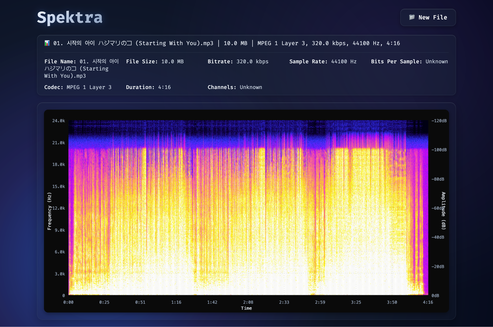

# Spektra




Spektra is a static web-based spectrum analyzer that visualizes audio files using Fast Fourier Transform (FFT) to display frequency content over time. Inspired by tools like Spek, it allows users to upload audio files and view detailed spectrograms with professional-grade features like dB scaling, color mapping, and metadata display. Built as a single-page application (SPA) for easy deployment on platforms like GitHub Pages.

## Motivation

As a passionate audio enthusiast, I've encountered numerous instances where I purchased 'FLAC' files from questionable sources, tried them out, and sensed they sounded no different from YouTube streams—only to discover they were low-quality rips with frequency content sharply truncated, commonly around 18 kHz rather than the full spectrum up to 20 kHz or beyond. This experience led me to develop a habit of rigorously verifying the actual frequency range of audio files.

Now, with the caveat that I believe a well-engineered 256kbps audio file is effectively indistinguishable from a 16-bit/48kHz FLAC, this still leaves me with a lingering distrust of online audio vendors.

Even when purchasing from trusted platforms like Qobuz, I prefer to validate that the files truly contain the claimed high-fidelity audio data. Tools like [Spek](https://spek.cc) have been invaluable in this regard, but their unavailability on certain platforms like Linux at some point, made me long for a lightweight, cross-platform analyzer accessible anytime.

This led to the idea behind Spektra: a lightweight, client-side, static web-based audio spectrum analyzer leveraging FFT, designed for universal accessibility and ease of use. My goal was to create a trustworthy tool that puts the power of spectral verification at users’ fingertips, without the hassle of installation or OS limitations.

## Features

- Audio File Upload: Supports MP3, M4A, FLAC, and more via drag-and-drop or file selection.
- Spectrogram Visualization: Displays frequency spectrum with logarithmic dB scaling and Spek-like color mapping.
- Metadata Display: Shows file details like bitrate, sample rate, codec, and duration in a compact, expandable header.
- Professional Labels: Frequency (Hz) on left, dB on right, time on bottom – matching industry standards.
- Performance Optimizations: Downsampling for large files to ensure smooth rendering.
- Cross-Browser Compatibility: Uses Web Audio API with fallbacks for broad support.
- Static Deployment: Runs entirely client-side with no backend required.

## Demo

Check out [Spektra](https://www.seungkilee.com/Spektra) or install and run it yourself.

## Installation

1. Clone the repository:

   ```
   git clone https://github.com/seungkilee-cs/Spektra.git
   cd Spektra
   ```

2. Install dependencies:

   ```
   npm install
   ```

   - Key dependencies: `fft-js` for FFT computations, `music-metadata-browser` for audio metadata extraction.

3. Run locally:

   ```
   npm start
   ```

   Open http://localhost:3000 in your browser.

4. Build for production:
   ```
   npm run build
   ```
   Deploy the `build/` folder to any static host (e.g., GitHub Pages, Netlify).

## Usage

1. Open the app in your browser.
2. Drag-and-drop or select an audio file (e.g., MP3).
3. View the generated spectrogram with metadata header.
4. Click the header to expand detailed file info.

Example metadata display:

- Compact: "file.mp3 | 10.0 MB | MPEG 1 Layer 3, 320.0 kbps, 44100 Hz, 4:16"
- Expanded: Full JSON-like details for advanced users.

For developers:

- Customize FFT parameters in `audioProcessor.js` (e.g., `fftSize = 1024`).
- Modify color mapping in `SpectrumCanvas.jsx` for different visual styles.

## Technologies

- **Frontend**: React.js for UI components and state management.
- **Audio Processing**: Web Audio API for decoding audio files.
- Fast Fourier Transform: Custom implementation in Javascript -> fft-js library -> 🦀 Rust + WASM implementation.
- **Metadata**: music-metadata-browser for extracting audio tags.
- **Visualization**: HTML Canvas for efficient pixel rendering.
- **Build Tools**: Vite for fast development and bundling.

## Current Iterations

Spektra is a prototype with room for enhancement.

### High Priority

- [x] 🦀 Rust + WASM for FFT: Javascript FFT is feasible but slow. Even the native JS FFT library is not performant for larger files, and un-optimized high level implementation will definitely crash. So I'm working to replace JavaScript FFT with a high-performance Rust implementation compiled to WebAssembly. This could improve processing speed by 3-10x for large files, enabling near-native performance in the browser.

Checkout the [performance differences](./docs/fft-js_rust+wasm_comparison.md).

- [x] Revamp the Ui: Modernize the UI with a dark theme, responsive design, zoom/pan functionality for spectrograms, and customizable color schemes. Current vibe I am shooting for is "Spek for Web."

- [ ] Add More File Format Support: Want to add support for WAV, OGG, ALAC.

- [ ] Responsive Design: Updating CSS for visuals

### Low Priority

- [ ] Mobile optimization and PWA support: To leverage the cross platform strength I want to make the responsive design work with mobile

- [ ] Real-Time Analysis: Add microphone input for live audio visualization, with options for real-time spectrograms and peak detection.

- [ ] Export options (PNG/JPG of spectrogram, CSV of frequency data).

- [ ] Comparative analysis (overlay multiple audio files).

- [ ] Performance Enhancements: If Rust FFT doesn't work as performant as I want it to, I'm looking to delving deeper into multi-threading via Web Workers, GPU acceleration with WebGL for rendering.

## License

This project is licensed under the MIT License. See the [LICENSE](LICENSE) file for details.

---

Built by [seungkilee-cs](https://github.com/seungkilee-cs). Inspired by Spek and the need for a lightweight, web-based audio analyzer.
